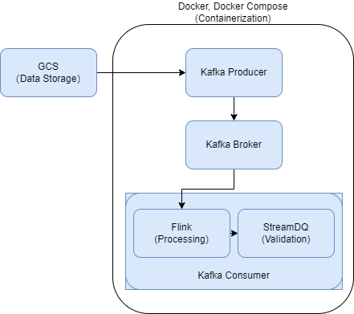

# Streaming Data Quality Validation

## Overview

This project aims to validate the quality of streaming data in real-time, using NYC Taxi Rides datasets as a case study. It leverages the power of Kafka for streaming, Flink for data processing, and [StreamDQ](https://github.com/stefan-grafberger/StreamDQ) for data quality validation, ensuring high-quality training data for modern data-driven applications.

## Requirements

- Docker
- Docker-compose
- Python 3
- Java 11
- Maven
- [StreamDQ](https://github.com/stefan-grafberger/StreamDQ) 


## Framework
- Google Cloud Storage (for data storage)
- Kafka (for streaming)
- Flink (for processing)
- [StreamDQ](https://github.com/stefan-grafberger/StreamDQ) (for data quality validation)




## Usage

1. Clone the repository:
    ```bash
    git clone https://github.com/zy969/streaming-data-quality-validation.git
    ```

2. Automatically download the datasets and upload them to Google Cloud Storage: 
    ```bash
    python ./scripts/upload-file-to-gcp.py 
    ```


3. Build the Docker image and run Docker Containers:
    ```bash
    ./scripts/build-and-run.sh
    ```
To ensure a smooth execution of the script, please make sure all the requirements listed in the [Requirements](#requirements) section are properly installed on your system.

4. To monitor the logs of the running containers:
    ```bash
    docker-compose logs
    ```

EN:(Check Consumer)/CN:(查看Consumer)

docker logs streaming-data-quality-validation-consumer-1

docker-compose logs -f consumer

EN:(Check Containers)/CN:(查看容器)
docker ps


5. To stop and remove containers:
    ```bash
    docker-compose down
    ```

EN:(Remove all images)/ CN:(移除所有镜像)
docker rmi -f $(docker images -q)


## EN:Frequent issues

- In stage of mvn package, if there is an error.1.Use 'mvn --version' to insure your JAVA version is 11.  2. Can't find class 'Streamdq', check local maven repo to make sure 'streamdq-1.0-SNAPSHOT.jar' exists. If not, install it with java 11 using repo 'stefan_grafberger/StreamDQ'. If it exist, then replace it with our modified streamdq to replace the local repo's.

- permission denied: Make sure you have permission to run it.

- bash issue: Check your shell is CRLF format

- In order to pull docker image, you need to login in and join our docker group.

## CN:故障排查

- mvn package阶段报错，检查mvn --version是否为java11。streamdq找不到类，检查自己本地maven仓库是否包含streamdq-1.0-SNAPSHOT.jar。如果不存在，用java11进行安装。如果存在，用我们仓库里的streamdq-1.0-SNAPSHOT.jar把它替换掉

- permission denied类问题：需保证 ./scripts/build-and-run.sh 有执行权限

- bash问题：检查sh脚本是否都是lf而不是crlf

- dockerhub需是登陆状态，docker info检查


## EN: Data types/ CN:数据结构
//        green_tripdata.parquet
//        VendorID int32
//        lpep_pickup_datetime datetime64[us]
//        lpep_dropoff_datetime datetime64[us]
//        store_and_fwd_flag object
//        RatecodeID float64
//        PULocationID int32
//        DOLocationID int32
//        passenger_count float64
//        trip_distance float64
//        fare_amount float64
//        extra float64
//        mta_tax float64
//        tip_amount float64
//        tolls_amount float64
//        ehail_fee float64
//        improvement_surcharge float64
//        total_amount float64
//        payment_type float64
//        trip_type float64
//        congestion_surcharge float64


   VendorID lpep_pickup_datetime lpep_dropoff_datetime store_and_fwd_flag  \
0         2  2018-12-21 15:17:29   2018-12-21 15:18:57                  N   
1         2  2019-01-01 00:10:16   2019-01-01 00:16:32                  N   
2         2  2019-01-01 00:27:11   2019-01-01 00:31:38                  N   
3         2  2019-01-01 00:46:20   2019-01-01 01:04:54                  N   
4         2  2019-01-01 00:19:06   2019-01-01 00:39:43                  N   

   RatecodeID  PULocationID  DOLocationID  passenger_count  trip_distance  \
0         1.0           264           264              5.0           0.00   
1         1.0            97            49              2.0           0.86   
2         1.0            49           189              2.0           0.66   
3         1.0           189            17              2.0           2.68   
4         1.0            82           258              1.0           4.53   

   fare_amount  extra  mta_tax  tip_amount  tolls_amount  ehail_fee  \
0          3.0    0.5      0.5        0.00           0.0        NaN   
1          6.0    0.5      0.5        0.00           0.0        NaN   
2          4.5    0.5      0.5        0.00           0.0        NaN   
3         13.5    0.5      0.5        2.96           0.0        NaN   
4         18.0    0.5      0.5        0.00           0.0        NaN   

   improvement_surcharge  total_amount  payment_type  trip_type  \
0                    0.3          4.30           2.0        1.0   
1                    0.3          7.30           2.0        1.0   
2                    0.3          5.80           1.0        1.0   
3                    0.3         19.71           1.0        1.0   
4                    0.3         19.30           2.0        1.0   

   congestion_surcharge  
0                   NaN  
1                   NaN  
2                   NaN  
3                   NaN  
4                   NaN  


